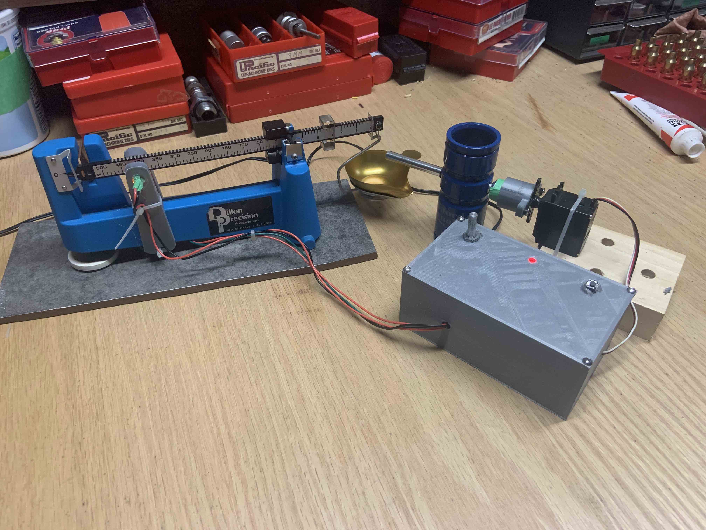
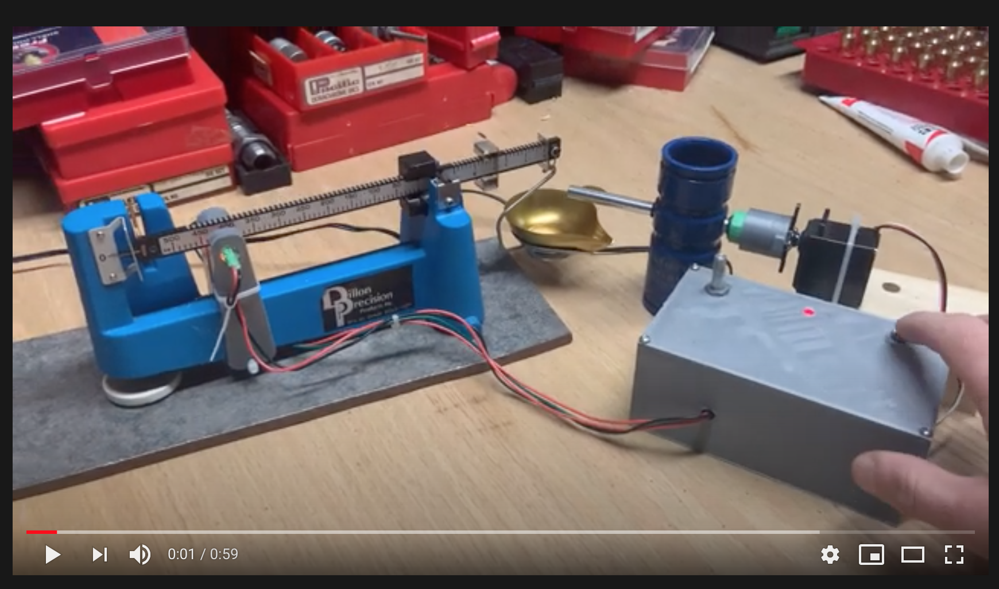
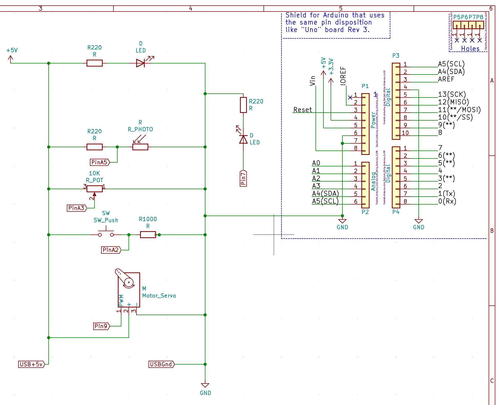

# Auto_Powder_Dispenser

Reloading is dangerous, this is not intended to teach you to reload.

Always use best practices for reloading and follow a manual, use at your own risk.

## What is it?

An Arduino powered auto powder dispenser for beam scales capable of repeatable +/- 0.05 grain accurate powder throws.

## Why Should you use a beam based powder scale over a digital scale?

1. Even expensive digital scales can suffer from drift and sticky measureing when weighing small increases in weight.
2. Temperature, air currents, low batteries or electrical interference can change measured values.
3. Warmup times slow down workflow.

A beam scale will measure exactly the same every time it is used and typically can hold tolerances over the range of the scale. It doesn't use batteries, and isn't as affected by air currents. As long as you use the same scale each time and set the zero the same it should produce the same charges. 

## Watch it work!
https://youtu.be/rCnM_-ORX8Y

